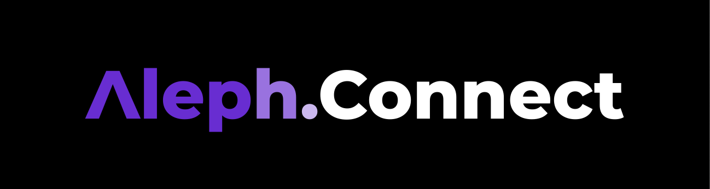

[](https://www.gnu.org/licenses/gpl-3.0)
[](https://use.ink)


## AlephConnect: Connecting Employers and Freelancers Seamlessly

**Project Overview:**

AlephConnect is a decentralized application (dApp) built on the AlephZero blockchain that empowers employers and freelancers to collaborate on projects in a secure, transparent, and efficient manner. It streamlines the process of finding skilled talent, negotiating terms, and ensuring trust throughout the work cycle.

**How to run the app**

The frontend works out of the box, without a local node running, as the sample contract is pre-deployed. Necessary deployment metadata and addresses are provided under `contracts/deployments/`.

> **Pre-requisites:**
>
> - Setup Node.js v18+ (recommended via [nvm](https://github.com/nvm-sh/nvm) with `nvm install 18`)
> - Install [pnpm](https://pnpm.io/installation) (recommended via [Node.js Corepack](https://nodejs.org/api/corepack.html) or `npm i -g pnpm`)
> - Clone this repository

<details>
<summary><strong>Special Instructions for Windows Users</strong></summary>

> [!IMPORTANT]  
> Windows users must either use [WSL](https://learn.microsoft.com/windows/wsl/install) (recommended) or a custom shell like [Git Bash](https://git-scm.com/downloads). PowerShell is not supported.

> **Pre-requisites when using WSL for Linux:**
>
> - Install [WSL](https://learn.microsoft.com/windows/wsl/install) and execute _all_ commands in the WSL terminal
> - Setup Node.js v18+ (recommended via [nvm](https://github.com/nvm-sh/nvm) with `nvm install 18`)
> - Install the following npm packages globally:
> - `npm i -g npm`
> - `npm i -g pnpm node-gyp make`
> - Clone this repository into the WSL file system (e.g. `/home/<user>/inkathon`).
>
> **Tip:** You can enter `\\wsl$\` in the top bar of the Windows Explorer to access the WSL file system visually.

</details>

```bash
# Install dependencies (once)
# NOTE: This automatically creates an `.env.local` file
pnpm install

# Start Next.js frontend
pnpm run dev
```

**Key Features:**

- **Auction-based Project Posting:** Employers clearly define their project requirements and set a duration (10 days by default).
- **Freelancer Offer Submission:** Freelancers can propose offers, specifying their reward and completion timeframe.
- **Employer Offer Selection:** Employers have the flexibility to choose the most suitable offer based on their criteria.
- **Secure Escrow System:** Upon offer acceptance, employers deposit the agreed-upon reward in AlephZero tokens, acting as collateral during the project duration.
- **Freelancer Incentives:** To encourage timely completion, freelancers also deposit a fixed amount of tokens, which are returned upon successful delivery or slashed in case of non-fulfillment.
- **Dispute Resolution:** In case of disagreements, a Decentralized Autonomous Organization (DAO) serves as a neutral mediator.

**Version Roadmap:**

- **v2:**
  - Subtask Management: Break down projects into smaller, manageable tasks for phased completion and partial payments.
  - Stablecoin Support: Offer flexibility beyond AlephZero's native token.
  - Improved User Experience: Implement a robust indexer to enhance search and data retrieval.
- **v3:**
  - Reputation System: Integrate Soulbound Tokens (SBTs) to establish user credibility and trust within the ecosystem.

**Benefits:**

- **Transparency and Trust:** Smart contracts automate key processes, ensuring fairness and eliminating potential conflicts.
- **Security and Efficiency:** Blockchain technology guarantees the immutability of data and facilitates secure transactions.
- **Flexibility and Cost-Effectiveness:** The decentralized nature removes intermediaries, reducing fees and enabling flexible collaboration models.
- **Global Reach:** AlephConnect connects employers and freelancers worldwide, fostering a diverse and inclusive talent pool.

**Getting Started:**

1. **Set up your AlephZero wallet:** Install wallet extension in your browser and create a wallet to interact with the blockchain.
2. **Connect to the AlephConnect dApp:** Use your wallet to access the dApp interface.
3. **Explore as an Employer:** Post projects, review freelancer offers, and manage agreements.
4. **Explore as a Freelancer:** Browse projects, submit proposals, and work on accepted tasks.

**Community and Support:**

- Join the AlephConnect community forum for discussions, announcements, and support.
- Refer to the AlephConnect documentation for detailed technical information and usage guides.

**Roadmap:**

We are actively committed to enhancing AlephConnect's capabilities. The roadmap outlines our vision for future development, focusing on:

- **Enhanced Project Management:** Introducing subtasks, partial completion, and milestone payments.
- **Expanded Payment Options:** Integrating stablecoins for broader market accessibility.
- **Improved User Experience:** Implementing an efficient indexer for faster data retrieval and smoother operation.
- **Reputation System:** Utilizing SBTs to establish trust and incentivize positive behavior.

**Contributing:**

We welcome contributions from the community to help us shape the future of AlephConnect. Feel free to engage in discussions, report issues, or submit pull requests on our GitHub repository.

**Together, let's build a more empowered and secure future for freelance work!**
